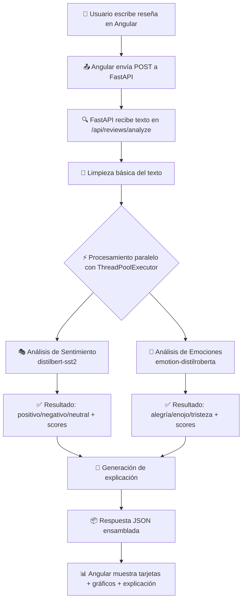

# EmoReview
### Analizador inteligente de emociones y sentimiento en reseñas

---

## 1. Planteamiento del Problema

Las empresas reciben miles de reseñas de clientes a diario. Analizarlas manualmente es ineficiente, costoso y subjetivo. Los clientes expresan no solo si algo fue bueno o malo, sino emociones complejas: alegría, enojo, miedo, sorpresa. Entender esas emociones permite a las empresas mejorar sus productos y servicios de forma mucho más precisa.

**IntesamenIA** propone automatizar este análisis mediante técnicas de Procesamiento de Lenguaje Natural (NLP) y modelos de inteligencia artificial preentrenados, eliminando la necesidad de revisión manual y permitiendo análisis en tiempo real.

---

## 2. Objetivo General

Desarrollar una aplicación web llamada **EmoReview** que, mediante modelos preentrenados de Hugging Face, analice automáticamente el **sentimiento** (positivo, negativo, neutral) y la **emoción dominante** (alegría, tristeza, enojo, miedo, sorpresa, etc.) de reseñas escritas por usuarios, mostrando los resultados de forma visual e intuitiva.

---

## 3. Metodología

### Diagrama de flujo del sistema



---

## 4. Desarrollo

### Arquitectura general

El sistema tiene dos capas independientes que se comunican via HTTP:

- **Backend (FastAPI)**: procesa el texto con modelos de IA y retorna JSON
- **Frontend (Angular)**: presenta la interfaz y consume el API REST

### Backend

- `main.py` inicia FastAPI, configura CORS y carga los modelos al arrancar
- `model_loader.py` descarga y almacena los modelos Hugging Face en memoria
- `review_analysis_service.py` coordina el flujo con paralelismo
- `sentiment_service.py` y `emotion_service.py` ejecutan inferencia con cada modelo
- `explanation_service.py` genera texto explicativo con plantillas
- `dataset_service.py` evalúa el modelo sobre el dataset SST-2

### Frontend

- `review-analyzer.component` es el componente principal con el formulario
- `review-api.service.ts` centraliza las llamadas HTTP al backend
- `result-card.component` muestra tarjetas reutilizables con colores por resultado
- `confidence-chart.component` renderiza gráficos de barras con Chart.js

### Modelos preentrenados de Hugging Face

| Tarea | Modelo | Clases |
|-------|--------|--------|
| Sentimiento | `distilbert-base-uncased-finetuned-sst-2-english` | POSITIVE, NEGATIVE |
| Emociones | `j-hartmann/emotion-english-distilroberta-base` | joy, anger, sadness, fear, surprise, disgust, neutral |

**Los modelos están en inglés.** Se recomienda escribir las reseñas en inglés para mejores resultados.

### Dataset

- **Nombre**: SST-2 (Stanford Sentiment Treebank, versión 2)
- **Fuente**: `huggingface.co/datasets/glue` → split `sst2`
- **Contenido**: Reseñas de películas en inglés etiquetadas como positivas (1) o negativas (0)
- **Total de datos de validación**: ~872 ejemplos (split oficial de validación del benchmark GLUE)
- **Uso en este proyecto**: 100 ejemplos de validación para evaluar el modelo en el endpoint `/evaluation`
- **División 80/20**: El modelo ya fue entrenado con ~67,000 ejemplos (80%) y validado con ~8,500 (20%) por los autores. Este proyecto solo hace inferencia, no re-entrenamiento.
- **Limitaciones**: Solo reseñas de películas; puede no generalizar perfectamente a otros dominios (restaurantes, productos tecnológicos, etc.).

### Paralelismo

En `review_analysis_service.py` se usa `concurrent.futures.ThreadPoolExecutor` con 2 hilos:

```python
with ThreadPoolExecutor(max_workers=2) as executor:
    future_sentiment = executor.submit(analyze_sentiment, cleaned)
    future_emotion = executor.submit(analyze_emotion, cleaned)
    # Ambas tareas corren al mismo tiempo
```

Esto reduce el tiempo de respuesta porque los dos modelos procesan el texto simultáneamente.

### Overfitting y Underfitting

Este proyecto **no entrena modelos desde cero**, lo que elimina la mayoría de los riesgos:

| Riesgo | Medida adoptada |
|--------|----------------|
| Overfitting | No hay fine-tuning: se usan modelos preentrenados en millones de ejemplos |
| Underfitting | Los transformers (DistilBERT, RoBERTa) son modelos potentes con alta capacidad |
| Evaluación | Se evalúa sobre 100 ejemplos de validación del dataset SST-2 |
| Métricas | Accuracy, Precision, Recall, F1-score via Scikit-learn |

Si en el futuro se quiere hacer fine-tuning, se debe usar early stopping, división 80/20, límite de épocas y guardado del mejor modelo.

---

## 5. Resultados esperados

### Entrada ejemplo:
```json
{ "text": "The food was absolutely amazing and the service was outstanding!" }
```

### Salida ejemplo:
```json
{
  "original_text": "The food was absolutely amazing and the service was outstanding!",
  "cleaned_text": "the food was absolutely amazing and the service was outstanding",
  "sentiment": {
    "label": "positivo",
    "score": 0.9997,
    "all_scores": [
      { "label": "positivo", "score": 0.9997 },
      { "label": "negativo", "score": 0.0003 }
    ]
  },
  "emotion": {
    "label": "alegría",
    "score": 0.9234,
    "all_scores": [...]
  },
  "explanation": "La reseña fue clasificada como 'positivo' con una confianza del 99%...",
  "processing_time_seconds": 0.842
}
```

### Métricas típicas del modelo en SST-2 (validación):
- Accuracy: ~0.91
- Precision: ~0.91
- Recall: ~0.91
- F1-score: ~0.91

---

## 6. Discusión

### Comparación con enfoques tradicionales

| Enfoque | Ventajas | Desventajas |
|---------|----------|-------------|
| Naive Bayes / SVM | Rápido, interpretable | Requiere ingeniería de features manual |
| BERT / RoBERTa (fine-tuning) | Alta precisión | Costoso en datos y computación |
| **Modelos preentrenados (este proyecto)** | Listo para usar, alta precisión sin entrenamiento propio | Limitado al dominio del preentrenamiento |

### Limitaciones del sistema
- Los modelos están en inglés; reseñas en español tendrán peor desempeño
- El modelo de sentimiento solo clasifica entre positivo y negativo (no neutral en SST-2)
- La explicación usa plantillas, no IA generativa (es determinista)
- El sistema no aprende con el uso (sin feedback loop)

---

## 7. Conclusiones

EmoReview demuestra que es posible construir un sistema funcional de análisis de sentimientos y emociones reutilizando modelos preentrenados de Hugging Face, sin necesidad de entrenar desde cero. El uso de paralelismo con `ThreadPoolExecutor` reduce el tiempo de respuesta. La arquitectura modular (FastAPI + Angular) facilita el mantenimiento y la extensión del sistema.

**Mejoras futuras**:
- Agregar soporte multilingüe con modelos como `cardiffnlp/twitter-xlm-roberta-base-sentiment`
- Implementar historial de análisis con base de datos
- Agregar fine-tuning opcional con early stopping
- Desplegar en la nube (Railway, Vercel, etc.)

---

## 8. Instalación

Se recomienda la versión de python 3.10.x, para evitar conflictos con las librerias necesarias

### Requisitos previos
- Python 3.10 o superior
- Node.js 18+ y npm
- Angular CLI (`npm install -g @angular/cli`)

### Backend
```bash
cd backend
python -m venv venv

# En Linux/Mac:
source venv/bin/activate

# En Windows:
venv\Scripts\activate

pip install -r requirements.txt
```

### Frontend
```bash
cd frontend
npm install
```

---

## 9. Ejecución

### Paso 1: Iniciar el backend

```bash
cd backend
source venv/bin/activate  # o venv\Scripts\activate en Windows
uvicorn app.main:app --reload
```

La primera vez descargará los modelos de Hugging Face (~300MB). Esperar el mensaje:
```
Modelos cargados correctamente. EmoReview API lista.
```

Backend disponible en: `http://localhost:8000`  
Documentación automática: `http://localhost:8000/docs`

### Paso 2: Iniciar el frontend

```bash
cd frontend
ng serve
```

Frontend disponible en: `http://localhost:4200`

---

## 10. Cómo probarlo

1. Abrir `http://localhost:4200` en el navegador
2. Escribir una reseña en inglés, por ejemplo:
   - Positiva: *"This restaurant was absolutely fantastic! The food was delicious and the staff was incredibly friendly."*
   - Negativa: *"Terrible experience. The food was cold, the service was rude and I waited for over an hour."*
   - Mixta: *"The hotel room was nice but the breakfast was disappointing and quite expensive."*
3. Hacer clic en **Analizar reseña**
4. Ver los resultados: tarjetas de sentimiento y emoción, gráficos, explicación

Para probar la API directamente:
```bash
curl -X POST http://localhost:8000/api/reviews/analyze \
  -H "Content-Type: application/json" \
  -d '{"text": "The product quality is amazing!"}'
```

Para ver las métricas del modelo:
```bash
curl http://localhost:8000/api/reviews/evaluation
```
